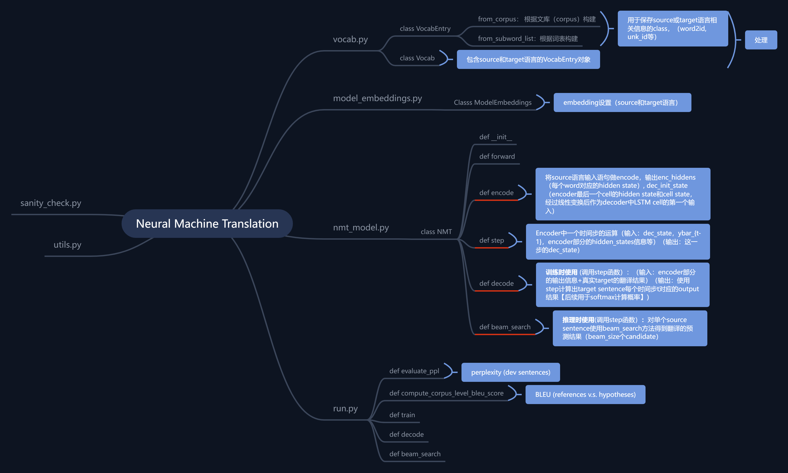

# NMT Assignment
Note: Heavily inspired by the https://github.com/pcyin/pytorch_nmt repository

# 代码结构
链接https://www.zhixi.com/view/d232259a

# pytorch 学习
* squeeze / unsqueeze： 将维度为1的维度压缩 / 在指定维度做扩展 （可以指定dim）  
* permute：将数据的维度做交换
* reshape/view：变换数据维度，功能类似
* torch.bmm：batch matrix multiplication，两个三维tensor做乘法，第一个维度为batch_size，后面两个维度做矩阵乘法
* tensor.split： 创建iterable对象，对向量按指定维度切割；例子：Y.split(split_size=1, dim=0)
* torch.cat, torch.stack： 堆叠list of tensor， stack会额外创建维度
* nn.Linear, nn.Dropout
* LSTM / LSTM cell 
* pack_padded_sequence / pad_packed_sequence
  输入LSTM前pack_padded_sequence；输出后pad_packed_sequence恢复成规整的Tensor
* torch.softmax。参数dim：按该维度softmax（例如：a为2维向量，则 b=softmax(a,dim=1), 则a[0,:]之和为1）
* torch.tanh
