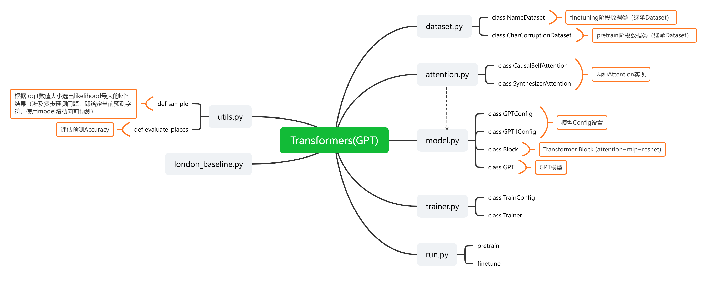

# 代码结构

链接：https://www.zhixi.com/view/037ca37e




# 相关要点

* Assignment 5 主要知识：GPT pretrain+finetune过程

* GPT预训练过程使用语言模型，根据过去的tokens信息预测当前tokens（attention阶段使用mask进行实现）

  `__init__`阶段创建`self.mask`，为下三角矩阵（方阵下三角部分和对角线元素为1）

  [一个细节：对角线元素为1，不mask当前token]

  ```python
  self.register_buffer("mask", torch.tril(
              torch.ones(config.block_size, config.block_size)).view(
                  1, 1, config.block_size, config.block_size))
  ```

  `forward`阶段：若self.mask中某个元素为0，att中对应元素替换为-1e10以实现mask

  ```python
  att = att.masked_fill(self.mask[:, :, :T, :T] == 0, -1e10)  
  att = F.softmax(att, dim=-1)
  ```

* 模型的输入和输出

  在pretrain和finetune阶段，模型的输入`x`和输出`y`均为 token sequence：

  * pretrain阶段

    * 输入输出形如：

      

      双问号（??）表示MASK_CHAR；正方形表示PAD_CHAR。

    * 设计原理：预训练阶段的用到的likelihood函数：
      $$
      L_1(\mathcal{U})=\sum_{i}\log P(u_i|u_{i-1},\dots,u_{i-k})
      $$
      上图中，`y`序列是`x`序列前移一个token的序列。因此，可以对`x`序列使用transformer编码（通过mask防止看到后续tokens），连接softmax函数，并与`y`的对应项计算loss。

    * GPT使用mask self-attention

      观察上述序列，可以看出`x`序列和`y`序列中穿插有MASK_CHAR，这对应于GPT的mask self-attention策略（不知道是不是这个project独有的设计，因为后面我们会发现这个设置会使得pretrain阶段的任务更接近后续finetune阶段的任务）

      具体来讲：在拿到原始序列之后，我们会挖一部分的`[masked_content]`出来，同时在原序列的相应位置用MASK_CHAR(双问号)填充，然后再把`[masked_content]`接在原序列后面，最终的序列：

      ```python
      # [prefix] MASK_CHAR [suffix] MASK_CHAR [masked_content] [pads]
      ```

      

  * finetune阶段（名人出生地预测问题）

    * 输入输出形如：

      
      
    * 设计原理：finetune阶段的likelihood函数：
      $$
      L_2(\mathcal{C})=\sum_{\boldsymbol{y}}\log P(\boldsymbol{y}|x_1,\dots,x_m)
      $$
      这儿$x_1,\dots,x_m$是问题对应的序列，$\boldsymbol{y}$是问题答案（注意：$\boldsymbol{y}$由多个tokens组成）。
    
      现在回过来看输入输出序列，就会发现它的设计非常巧妙：
    
      首先是x序列，x序列把问题和答案拼在了一起（用MASK_CHAR隔开）。其次是y序列，y序列是把x序列滞后一期之后的结果，但是除了答案部分都用PAD_CHAR给替换了。
      
      和pretrain阶段的任务一样，我们还是使用x序列使用transformer编码，连接softmax函数，并与`y`的对应项计算loss。
      
      这个loss实际上会接近于$L_2(\mathcal{C})$。首先，x序列的“问题”部分在y序列中都是PAD_CHAR，这一部分的loss基本上对模型拟合没有贡献（我猜的）；而loss重要的部分是在“答案”对应的那几个字符串。把那几个字符串单拎出来对其一下实际上是长这样的：
      
      
      
      对应一下，这部分的loss对应的是**基于“问题”序列和当前“答案”已有的tokens滚动预测下一个tokens的log-likelihood值**，也就是：
      $$
      \sum_{\boldsymbol{y}}\log P(\boldsymbol{y}|x_1,\dots,x_m)=\sum_{j=1}^M\log P({y}_j|x_1,\dots,x_m,y_1,\dots,y_{j-1})
      $$
      这就和原理对上了！而且这样一个滚动的预测过程是可以运用在inference阶段的。
      
      现在再回过头看一下pretrain阶段的MASK Language的设计，就会发现，这个挖空预测的做法和finetune阶段的预测过程非常像。因此这个预训练过程对finetune阶段的训练是有很大帮助的。（未finetune时的Accuracy在0.02，finetune后是0.22）。
      
      
  
  # Pytorch学习
  
  * Dataset类的定义与使用
  * 各类矩阵运算，如torch中： `A@B=torch.matmul(A,B)`，以及broadcast机制等。
  
  